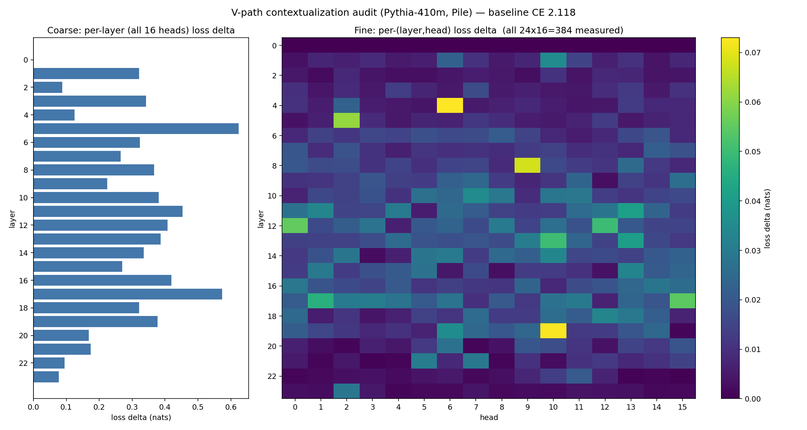
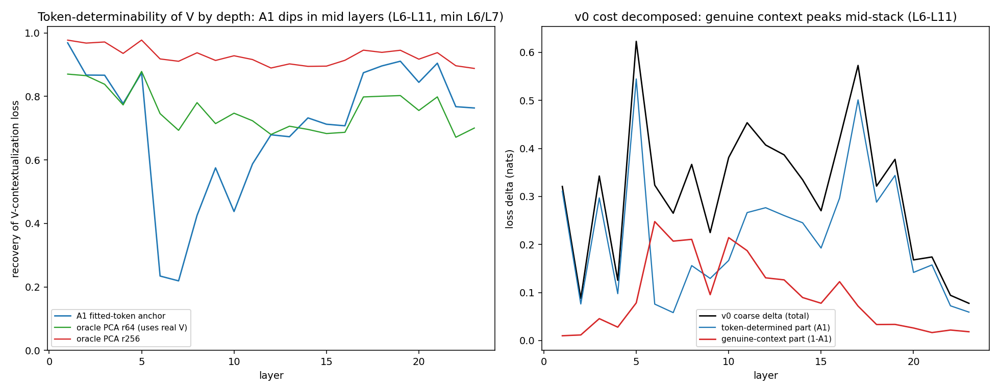
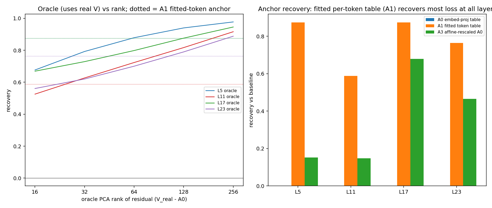
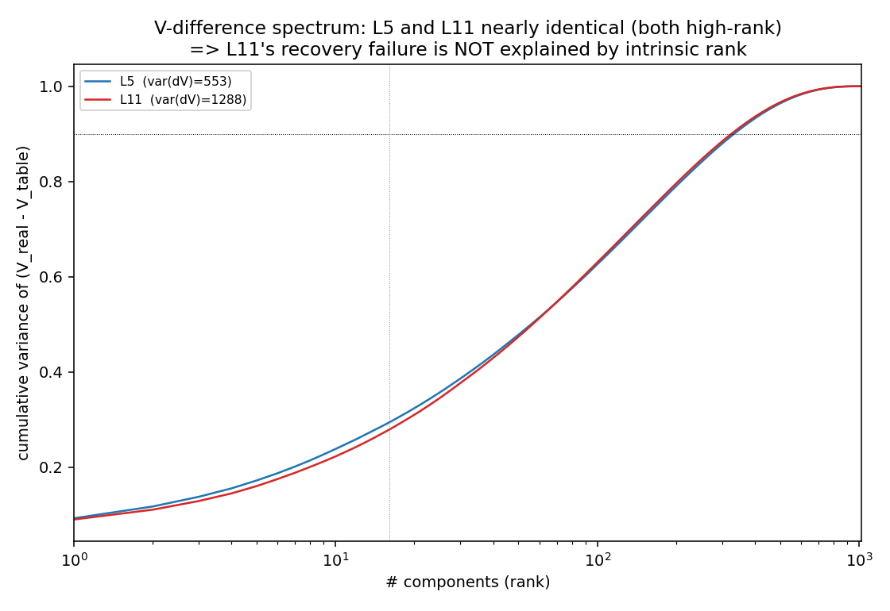
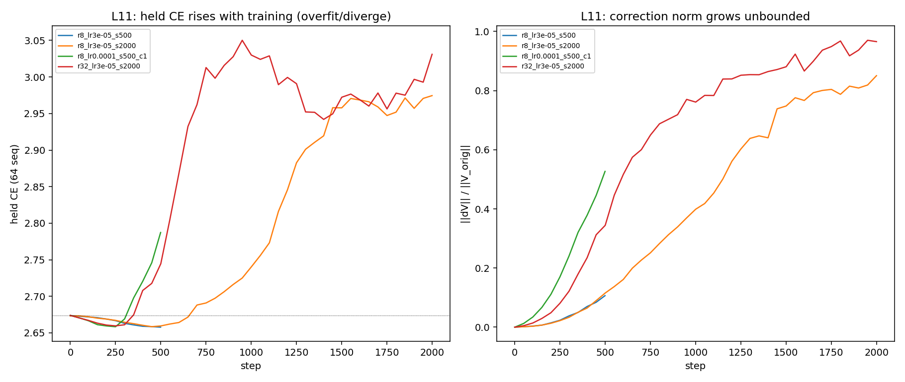
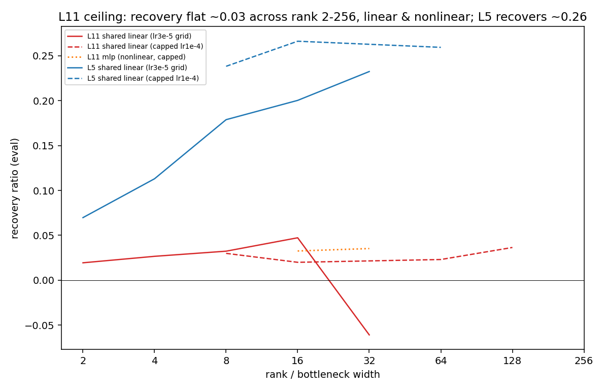
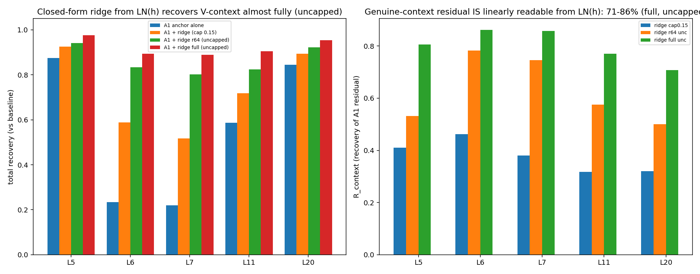
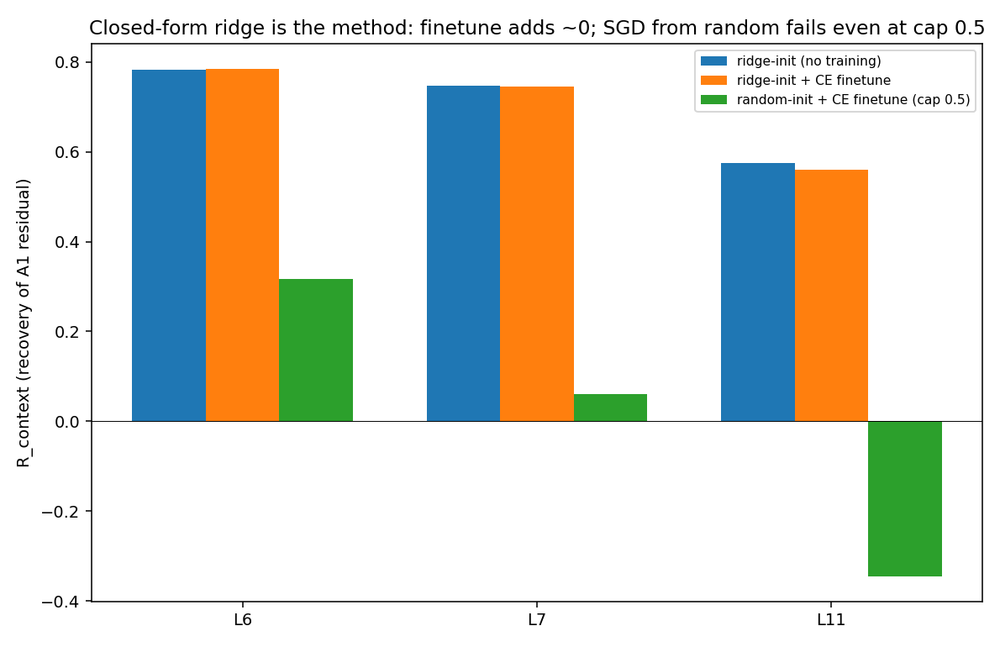
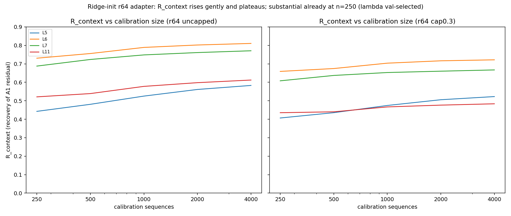
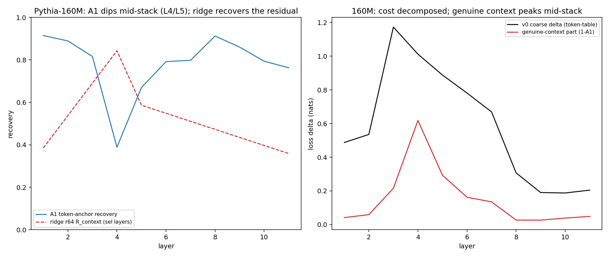

# Token Lookup, Not Contextualization: The Attention Value Path Is Mostly Token-Determined, and Its Context Residual Is Linearly Present but SGD-Unlearnable

*Working draft for internal revision. All quantitative results are from the experiments in this repository
(`outputs/`); numbers are reproducible from the released scripts. Citations marked [TODO] need bibliographic
verification before submission.*

---

## Abstract

Attention's value (V) path carries cross-token context because each value vector
`V_t = W_V·LN_l(h_{l-1,t})` is computed from an already-contextualized hidden state. We
ask how much of a layer's value-path contribution to next-token loss is genuine
contextualization versus a per-token lookup, and whether any residual context is
learnable. Ablating a layer's V down to a token-only "table" value
`A0 = W_V·LN_l(E[x_t])` costs 0.08–0.62 nats per layer in Pythia-410M (an inverted-U over
depth), seemingly implicating value-side contextualization broadly. We show this is
largely an artifact of a **weak anchor**: a directly *fitted* per-token value table `A1`
recovers 59–88% of that loss. Since both A0 and A1 are context-free, most of the ablation
cost reflects the embedding-projected table being a poor approximation of the per-token
mean value, not contextualization. The genuine context residual is **concentrated in
mid-stack layers** and is much smaller than the raw ablation implies. We then find a sharp
**optimization–representation dissociation**: the residual is a *generalizing linear
function* of the same hidden state that produced V — a closed-form ridge readout recovers
71–86% of it on held data — yet SGD-trained low-rank and MLP adapters reading that input
recover essentially none of it (~3% over A0, +0% over A1), across rank, nonlinearity,
learning rate, gradient clipping, and norm budget. Factoring the ridge solution into LoRA
factors yields a **training-free, deployable** value correction that reproduces the ridge
recovery zero-shot. The bottleneck is therefore **optimization, not representation**. All
findings replicate across two Pythia scales (160M, 410M), with the depth profile shifting
but not changing character.

---

## 1. Introduction

Transformer attention routes information through three projections of the (layernormed)
residual stream — query, key, and value. The value path determines *what* is written to
each attended position: `V_t = W_V·LN_l(h_{l-1,t})`. Because `h_{l-1,t}` has been mixed by
earlier attention layers, V is in principle contextualized. A recurring question in
mechanistic interpretability and in efficiency work (e.g., whether value contextualization
can be cheaply approximated) is **how much** of the value path is genuinely contextual.

A standard answer is an ablation: replace V with a context-free, token-only value and
measure the loss increase. We begin there, but show that the naive ablation badly
overstates value contextualization, and that disentangling the measurement changes the
scientific conclusion three times. Our investigation is structured as a falsification
chain — each experiment refutes the lazy reading of the previous one — and ends with a
method plus a cautionary negative result.

**Contributions.**
1. **A token/context decomposition of the value path.** A fitted per-token value table
   recovers most of what a token-only ablation costs; the residual that genuinely depends
   on context is small and concentrated in mid-stack layers. Ablations that swap in an
   *embedding-projected* table conflate "bad anchor" with "contextualization."
2. **An optimization–representation dissociation.** The context residual is a generalizing
   low-rank *linear* function of the current post-LN hidden state (closed-form ridge
   recovers 71–86%), but gradient-trained adapters reading the same input do not find it.
3. **A training-free value correction.** The ridge solution, rank-truncated and expressed
   as a LoRA adapter, is deployable and reproduces the recovery with no training; SGD from
   random initialization cannot match it even with a relaxed norm budget.
4. **Cross-scale replication** on Pythia-160M and 410M.

---

## 2. Related Work

**Attention value path and mechanistic analysis.** A line of interpretability work
decomposes attention into query–key (where to attend) and output–value (what is moved),
and studies value/output circuits via patching and ablation [TODO: Elhage et al.,
mathematical framework; Olsson et al., induction heads]. Our token/context decomposition
of V is in this spirit but quantifies, layer by layer, how much of the value path is a
per-token table.

**Activation patching / causal interventions.** Replacing internal activations with
alternatives to measure causal effect on the loss is standard [TODO: causal tracing /
activation patching references]. Our A0/A1 anchors and ridge injections are forward-hook
interventions of this type, with the twist that we *fit* the replacement and ask whether
the residual is *learnable*.

**Low-rank adaptation.** LoRA [TODO: Hu et al., 2021] parameterizes weight/activation
corrections as low-rank products trained by SGD. We use the same parameterization for the
correction but compare SGD training against a closed-form ridge solution factored into the
same low-rank form — isolating optimization from expressivity.

**Optimization vs. representation.** That a function is representable (and even linearly
present) does not imply gradient descent finds it; loss-landscape and conditioning effects
can prevent it [TODO: optimization-difficulty references]. Our result is a concrete,
mechanistically localized instance in a pretrained LM.

**Models and data.** We use the Pythia suite [TODO: Biderman et al., 2023] (GPT-NeoX
architecture [TODO: Black et al.]) trained on the Pile [TODO: Gao et al., 2020], using the
deduplicated checkpoints.

---

## 3. Background and Setup

**Models.** `pythia-410m-deduped` (24 layers, d_model=1024, 16 heads, head_dim=64) and
`pythia-160m-deduped` (12 layers, d_model=768, 12 heads, head_dim=64); GPT-NeoX; fp16;
single GPU. GPT-NeoX applies the pre-attention LayerNorm before a fused
`query_key_value` linear, reshaped per head as `[num_heads, 3·head_dim]`; rotary position
embeddings act on Q and K only, so V is position-free and the value of layer 0 equals the
raw token embedding's value (a useful sanity anchor).

**Data and splits.** Pile (train split), tokenized into 1024-token blocks. We use a
three-way *sequence-disjoint* split: **eval** = blocks[0:1000] (fixed; metric = mean
next-token cross-entropy with standard shift), **validation** = blocks[1000:2000]
(hyperparameter/λ selection), **calibration** = blocks[2000:6000] (anchor and ridge
fitting). Baseline eval CE: 2.118 (410M), 2.994 (160M).

**Intervention.** A forward hook on a target layer's `query_key_value` rewrites only the
V slice (Q, K untouched), leaving all other layers intact; we report the eval-CE delta vs.
the unmodified baseline. The per-head V-slice layout was verified against the GPT-NeoX
interleaving, and the layer-0 delta is exactly 0 (a no-op sanity check that the hook
plumbing is correct).

**Anchors and corrections.**
- `A0` (embedding-projected token table): `W_V·LN_l(E[x_t])`.
- `A1` (fitted token table): `μ_l[x] = E[V^real_l(t) | x_t = x]`, estimated on
  calibration; unseen tokens fall back to A0 (eval token coverage 97%).
- Low-rank correction: `V = anchor + (α/r)·LN_l(h)·A·B`, with A,B trained by SGD (random
  init, fan-in scaled) or set from a closed-form ridge solution.
- Closed-form ridge: `W = (XᵀX + λI)⁻¹XᵀY`, `X = LN_l(h)`, `Y = V_real − A1`; injected as
  `V = A1 + X·W`, optionally rank-truncated via SVD and norm-capped.

**Metrics.** `Δ_method = CE_method − baseline`. **Total recovery** `R_total = 1 −
Δ_method/Δ_A0`. **Context recovery** `R_context = (Δ_A1 − Δ_method)/Δ_A1`, the fraction of
the *post-anchor* residual that a method removes (the central quantity once A1 is in
place).

---

## 4. Method: a falsification chain

We proceed through interventions of increasing structure, each designed to test the
explanation left standing by the previous one:

1. **V→A0 ablation** (per layer and per head): does the value path matter, and is it
   localized?
2. **Anchor audit** (A0 vs fitted A1): is the ablation cost contextualization or a weak
   anchor? Where is genuine context?
3. **Trained corrector** (LoRA/MLP on LN_l(h), SGD): can the residual be learned?
4. **Closed-form ridge**: is the residual linearly present in LN_l(h), independent of SGD?
5. **Ridge-init LoRA + finetune comparison**: is the ridge solution deployable, and does
   SGD reach it?
6. **Calibration scaling** and **cross-scale (160M)**: robustness.

---

## 5. Results

### 5.1 The value path matters but is distributed (v0, 410M)

Replacing a whole layer's V with A0 costs 0.08–0.62 nats (median 0.32), forming an
inverted-U over depth peaking at L5 (0.62). Replacing a *single* head's V costs almost
nothing: **97.7% of all 384 (layer, head) pairs have |Δ| < 0.05** (median 0.012, max
0.073). The value-path cost is real but distributed across heads; no single head is
load-bearing.

*Figure 1. v0 (410M). Left: per-layer V→A0 ablation delta (inverted-U, peak L5). Right:
per-(layer,head) delta — nearly all heads ≈0; the cost is distributed, not localized.*

### 5.2 Most of the cost is a weak anchor (anchor audit)

A0 and A1 are *both* context-free per-token values, yet on eval A0 recovers 0% while A1
recovers **0.59–0.87** across layers. Most of the v0 ablation cost is therefore that the
embedding-projected table `W_V·LN(E[x])` is a poor stand-in for the per-token mean value,
not contextualization. The genuine residual `1 − R_{A1}` is **U-shaped in depth**: ~0.13
at early/late layers, concentrated mid-stack and peaking where the table is weakest
(410M: L6/L7, A1≈0.22; the original 4-layer probe at L5/11/17/23 had missed this trough).
An SVD of `V_real − A1` is high-rank (participation ratio ≈ 74–78; ~330 components for 90%
variance) and near-identical across layers, so depth-varying intrinsic rank does **not**
explain the residual differences.

*Figure 2. Full-depth anchor profile (410M). Left: A1 token-anchor recovery is U-shaped —
high at early/late layers, dipping mid-stack (min L6/L7). Right: the v0 cost decomposed
into token-determined (A1) and genuine-context (1−A1) parts; genuine context peaks
mid-stack.*

*Figure 3. Anchor audit. A0 (embedding-projected table) recovers ~0; A1 (fitted token
table) recovers 0.59–0.87; the oracle PCA of the residual (using real V) is high at all
layers. Both A0 and A1 are context-free.*

*Figure 4. Covariance spectrum of V_real−A1 at L5 vs L11 — near-identical and high-rank,
ruling out "deeper = higher intrinsic rank" as the explanation for the residual gap.*

*Table 1. 410M anchor recovery (selected layers).*

| layer | A0 | A1 (fitted) | oracle PCA r256 | genuine residual (1−A1) |
|---|---|---|---|---|
| L5  | 0.00 | 0.87 | 0.98 | 0.13 |
| L6  | 0.00 | 0.23 | 0.92 | 0.77 |
| L7  | 0.00 | 0.22 | 0.91 | 0.78 |
| L11 | 0.00 | 0.59 | 0.92 | 0.41 |
| L17 | 0.00 | 0.87 | 0.95 | 0.13 |

### 5.3 SGD-trained correctors fail on the residual

A low-rank or bottleneck-MLP adapter reading `LN_l(h)`, trained by SGD to correct V on top
of A0 or A1, recovers **~3% (A0 base) / +0% (A1 base)** of the residual. This is invariant
to rank (2–256), nonlinearity (GELU bottleneck), learning rate, gradient clipping, step
count (500–2000), and a 0.15 norm cap; deeper layers and higher ranks diverge under SGD
without the cap. Taken alone this looks like a representation ceiling.

*Figure 5. SGD-trained corrector on L11. Left: held CE rises as training continues (does
not improve); right: the correction norm ||ΔV||/||V|| grows unbounded — overfitting /
divergence, not undertraining. More steps and grad-clip do not help.*

*Figure 6. Trained-corrector recovery is pinned near 0 across rank 2–256 and linear vs.
nonlinear (mlp) at L11, while L5 plateaus ~0.26 — the "ceiling" that the ridge probe
(§5.4) overturns.*

### 5.4 The residual is linearly present (closed-form ridge)

A closed-form ridge map of the same input, fit on calibration and evaluated on held data,
recovers **71–86% of the residual at every probed layer** (`R_context`), with total
recovery 0.89–0.98 — including the most context-bound L6/L7 (0.86) and L11 (0.77). The
information is linearly present in `LN_l(h)` and generalizes; SGD simply did not find it.

*Figure 7. Closed-form ridge. Left: total recovery (uncapped full ridge ≈0.89–0.98). Right:
R_context (recovery of the post-A1 residual) is 0.71–0.86 at every layer — the residual is
a generalizing linear function of LN_l(h). The 0.15 norm cap (left bars) is far too tight.*

*Table 2. 410M ridge recovery (full-rank, λ by validation).*

| layer | A1 alone | ridge R_total | ridge R_context | cap0.15 R_context |
|---|---|---|---|---|
| L5  | 0.87 | 0.98 | 0.81 | 0.41 |
| L6  | 0.23 | 0.89 | 0.86 | 0.46 |
| L7  | 0.22 | 0.89 | 0.86 | 0.38 |
| L11 | 0.59 | 0.91 | 0.77 | 0.32 |
| L20 | 0.85 | 0.96 | 0.71 | 0.32 |

### 5.5 Training-free deployable correction; SGD genuinely cannot reach it

Factoring ridge `W` into LoRA factors `A = U_r S_r^{1/2}`, `B = S_r^{1/2} V_rᵀ` (so
`AB = W_r`) and injecting through the real adapter path **reproduces ridge zero-shot**
(410M, r64 R_context: L6 0.78, L7 0.75, L11 0.58 — matching the offline ridge to three
decimals, ruling out an evaluation-path artifact). CE finetuning on top adds ≈0 (L6
0.783→0.784): the closed-form solution is already near-optimal. Two culprits explain the
SGD failure:
- **Norm budget.** The 0.15 cap recovers only 0.32–0.46 vs 0.71–0.86 uncapped; the
  required correction norm exceeds it. cap≈0.3 suffices; cap 0.5 ≈ uncapped.
- **Landscape.** Even at the relaxed cap 0.5, **random-init CE finetune fails**
  (R_context: L6 0.32, L7 0.06, L11 −0.34) — far below ridge-init, sometimes worse than
  the anchor. SGD from random init does not reach the closed-form solution.

*Figure 8. Recovery of the A1 residual: ridge-init (no training) ≈ ridge-init + CE
finetune ≫ random-init + CE finetune (even at relaxed cap 0.5, sometimes negative). The
closed-form solution is the method; SGD does not reach it.*

### 5.6 Calibration-size robustness

With λ selected on a disjoint validation set, r64 ridge `R_context` rises gently with
calibration size and plateaus, and is already substantial at n=250 sequences (e.g. L6:
0.73 at 250 → 0.81 at 4000). The 1024×1024 ridge map is thus not merely saturating ~1M
calibration tokens; it generalizes from a few hundred sequences.

*Figure 9. r64 ridge R_context vs. calibration size (λ on a disjoint validation set),
uncapped (left) and cap0.3 (right). Recovery rises gently and plateaus, already
substantial at n=250 — not a saturation artifact of fitting ~1M params on ~1M tokens.*

### 5.7 Cross-scale replication (Pythia-160M)

All three claims reproduce at 160M (12 layers, d=768): A1 recovers 0.76–0.92 at most
layers, dipping mid-stack (L4 0.39, L5 0.67); r64 ridge recovers `R_context = 0.84` at the
most context-bound layer L4; a random-init CE finetune there gives **−0.17** vs.
ridge-init **0.73**. The depth profile shifts in index (mid-stack at L4/L5 vs. L6/L7) but
not in character.

*Figure 10. Pythia-160M replication. Left: A1 recovery dips mid-stack (L4/L5); the
selected-layer ridge R_context (dashed) fills the residual back in. Right: cost
decomposition — genuine context concentrated mid-stack, as in 410M.*

---

## 6. Discussion

The central finding is a dissociation: for deep value contextualization, **the
recoverable structure exists, is low-rank, and is linear in the obvious input**, yet
gradient descent from random initialization does not reach it — and a conservative norm
constraint adopted to stabilize SGD structurally precludes it. This has two implications.

*For interpretability methodology:* "a trained probe/adapter fails to recover X from
representation R" should **not** be read as "X is absent from R." A closed-form linear
readout is a much tighter test of presence, and here flips the conclusion.

*For value-path understanding:* once a properly fitted per-token anchor is in place, the
amount of genuinely context-dependent value content is modest and **localized to
mid-stack layers**. The widely cited "value contextualization" cost is, in these models,
mostly an artifact of measuring against an embedding-projected anchor.

*As a method:* an anchor + closed-form ridge readout, rank-truncated into a LoRA adapter,
is a cheap, training-free value correction, and serves as a tight upper bound for any
trainable variant.

---

## 7. Limitations

- Two model scales (160M, 410M) and one corpus (Pile); no check above 410M or on a
  different data distribution.
- A1 is a vocabulary×d table — a real memory cost we treat as a diagnostic/oracle anchor,
  not necessarily the final deployable form. A practical method would compress or amortize it.
- The deployable claim relies on rank-64 truncation of a d×d ridge map (which retains most
  of the recovery), and on the fitted ridge generalizing — supported by held-set
  evaluation and the calibration-scaling result, but the near-unregularized λ at L6/L7
  warrants a larger calibration set for a hard claim.
- We localize *that* SGD fails but not *why* (sharpness, conditioning, initialization).
  A direct landscape characterization (e.g., loss along the ridge↔SGD path, Hessian
  conditioning of the correction objective) is left to future work.

---

## 8. Conclusion

Most of the attention value path's contribution to next-token loss is a token lookup that
a fitted per-token table captures; the genuinely context-dependent residual is small,
mid-stack-concentrated, linearly present in the current hidden state, and recoverable in
closed form — but not by SGD. The result is simultaneously a method (a training-free
ridge-init value correction) and a cautionary negative result (optimization, not
representation, was the bottleneck), and it replicates across two Pythia scales.

---

## Appendix A. Reproduction

Pipelines and artifacts (branch `claude/zen-allen-7Y8Bx`):
- v0 ablation: `outputs/v_intervention.py` → `coarse_loss_delta.npy`, `fine_loss_delta.npy`,
  `heatmap.png`.
- anchor / ridge diagnostics: `outputs/v1a/v1a_correction.py` (modes: anchor, ridge,
  ridge_init, ridge_ft, ridge_scale, svd_diff) → `outputs/v1a/`, `outputs/v1b_ridge/`.
- cross-scale: `outputs/v1b_160m/repro160.py` → `outputs/v1b_160m/`.
- figures: depth_profile, anchor_audit, ridge_depth_probe, ridge_ft, ridge_scale,
  diff_spectrum, L11_ceiling, cap_probe, repro160_profile.
- dense findings log: `outputs/NARRATIVE_REPORT.md`.

## Appendix B. Methodological notes (lessons from the run)

- LoRA init scale must use fan-in = contraction dim (`1/sqrt(d_model)`), not `1/sqrt(r)`;
  the latter makes `LN(h)·A` variance ≈ d/r and diverges.
- LoRA B is zero-initialized, so `A.grad = 0` at step 0 (check the combined A,B gradient
  for dead-training detection).
- A fixed norm cap doubles as a silent capacity limit; report capped *and* uncapped.
- Closed-form ridge is the right first probe to separate "trainable" from "present."
